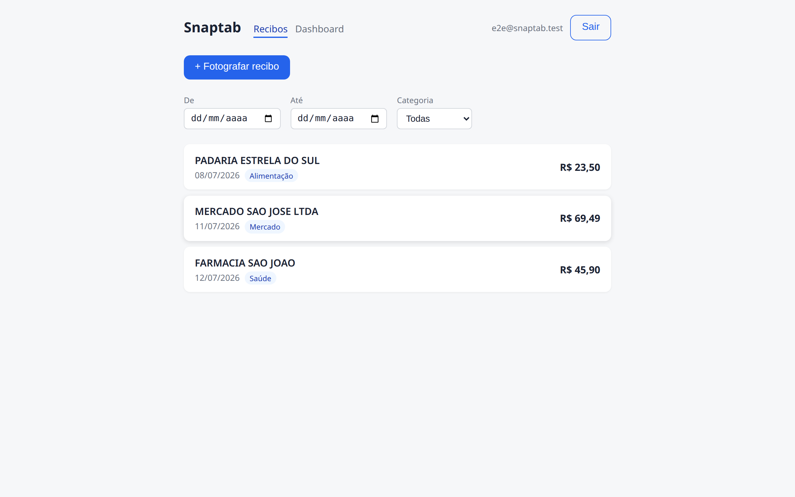
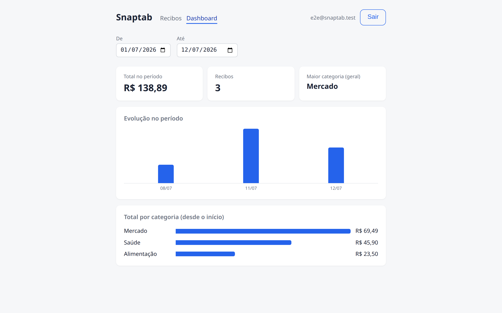
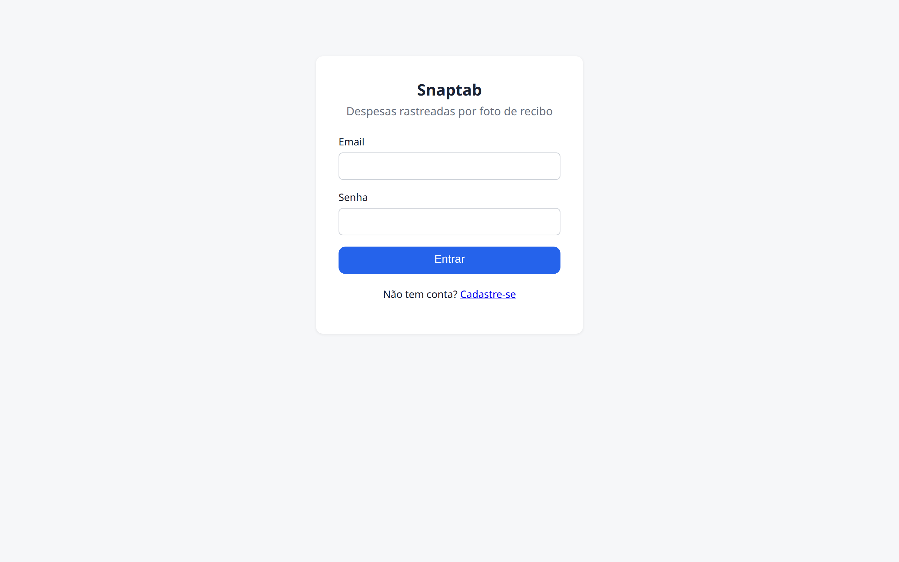
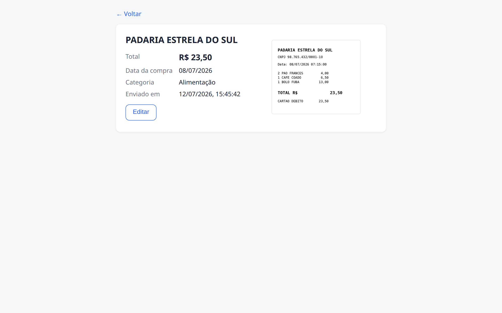
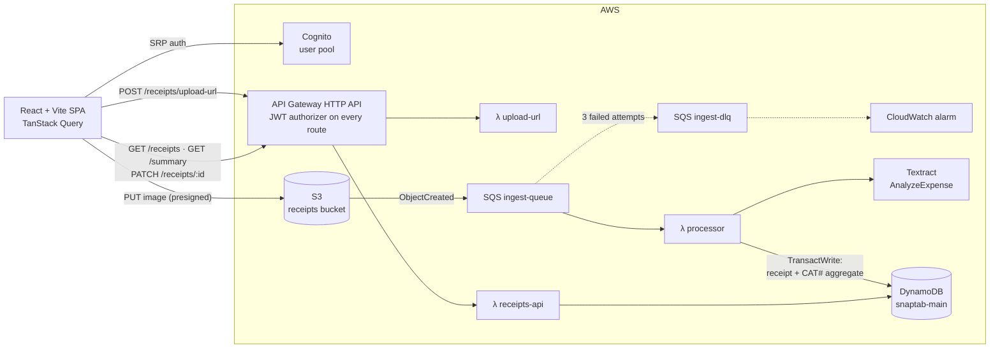
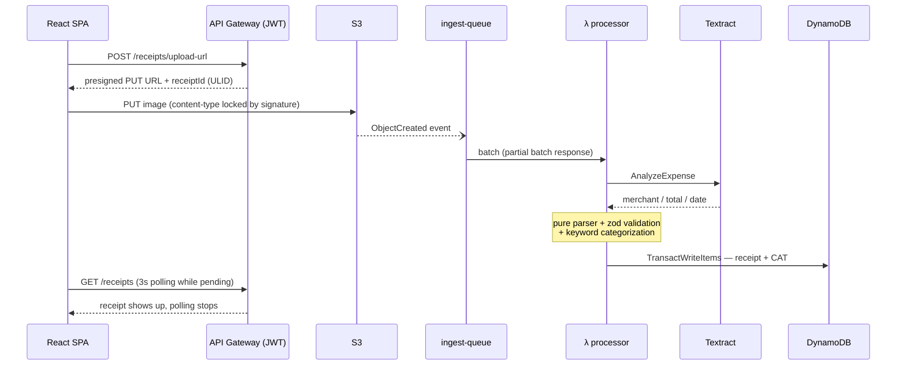

# Snaptab 📸🧾

**Serverless expense tracker: photograph a receipt → OCR extracts the total, date and merchant → dashboard with spending by category.**

Full-stack portfolio project: end-to-end TypeScript, event-driven AWS architecture, and 100% infrastructure-as-code (CDK). Not a single resource was created by clicking in the console.

| Receipts with filters | Dashboard |
|---|---|
|  |  |

| Login | Receipt detail |
|---|---|
|  |  |

---

## Architecture



### The ingest pipeline, step by step



The upload never touches a Lambda: the browser PUTs straight to S3 with a presigned URL whose signature locks the content type. Processing is fully asynchronous — the queue absorbs spikes, retries transient failures, and dead-letters anything that fails 3 times (which trips a CloudWatch alarm).

## Design decisions (and the *why* behind each)

| Decision | Why |
|---|---|
| **S3 → SQS → Lambda** (not S3 → Lambda directly) | Decouples upload from OCR: automatic retries, DLQ, spike absorption. Upload responds instantly; OCR runs in the background. |
| **DynamoDB single-table** (`PK`/`SK` + one GSI) | Every access is key-based, serverless scaling, no connection pools inside Lambda. Every query fits a designed access pattern — **zero `Scan` on any hot path**. |
| **`receiptId` is a ULID** (not UUID) | ULIDs sort lexicographically by creation time → the `RECEIPT#<id>` sort key comes back from DynamoDB already in "newest first" order with `ScanIndexForward=false`. No application-side sorting, ever. |
| **Money is integer cents** | `totalCents: 6949`, never floats. One parser (in `shared/`) handles both "R$ 1.234,56" and "1,234.56" — used by the OCR pipeline *and* the edit form in the browser. |
| **Receipt + `CAT#` aggregate in one `TransactWriteItems`** | True idempotency: replaying the same SQS message cancels the whole transaction (condition on the Put), so the aggregate can never be double-counted; and a crash can never leave receipt and aggregate out of sync. |
| **Idempotency key = S3 object key** (`<userId>/<receiptId>`) | Duplicate event delivery → `already-exists`, no duplicate rows (proven live by replaying a real S3 event). |
| **Typed errors in the processor** | `IrrecoverableError` (S3 test event, malformed key) → conscious ack; unreadable document → `failed` item the user can fix; everything else → retry → DLQ → alarm. |
| **Pagination cursors carry sort keys only** | The partition key is always rebuilt from the JWT at query time — a forged cursor can never page through another user's data. |
| **Manual correction with optimistic locking** | The PATCH transaction is conditioned on the values the deltas were computed from (`status`, `category`, `totalCents`); a concurrent edit returns 409 instead of silently corrupting aggregates. |
| **zod validation at every boundary, schemas in `shared/`** | Request bodies, SQS payloads, Textract output, even frontend env config — everything is validated before becoming a domain type. `api` and `web` import the exact same schemas. |
| **IAM least privilege** | Each Lambda gets only what it uses. The single documented exception: `textract:AnalyzeExpense` requires `Resource: *` (Textract has no resource-level permissions). |
| **Cognito JWT as the API's `defaultAuthorizer`** | Every route is born protected; `userId` comes from token claims, never from client input. |

## Data model

Single table `snaptab-main`:

| Entity | PK | SK | GSI1PK | GSI1SK |
|---|---|---|---|---|
| Receipt | `USER#<id>` | `RECEIPT#<ulid>` | `USER#<id>` | `DATE#<yyyy-mm-dd>` |
| Category aggregate | `USER#<id>` | `CAT#<category>` | — | — |

Access patterns, all key-based:

- **List receipts (newest first)** — `PK = USER#id AND begins_with(SK, 'RECEIPT#')`, descending (ULID = creation order)
- **Receipts by date range** — GSI1, `GSI1SK BETWEEN DATE#from AND DATE#to` (purchase-date order)
- **Spending by category** — the `CAT#` items, maintained atomically on every write (never recomputed by scanning)
- **Category filter** — `FilterExpression` on top of a partition-scoped query (not a `Scan`)

## Monorepo layout

pnpm workspaces — Node 20, strict TypeScript everywhere, no `any`:

```
packages/
├── shared/   # source of truth: domain types, zod schemas, Dynamo key builders, categorization rules
├── infra/    # AWS CDK stack + assertion tests (table keys, DLQ policy, JWT routes, alarm)
├── api/      # Lambda handlers: upload-url, processor, receipts-api — business logic lives in pure, testable modules
└── web/      # React + Vite + TanStack Query — zero business logic in components
```

## Getting started

Prerequisites: Node 20+, pnpm 10+, an AWS account with credentials configured and `cdk bootstrap` done in the region. Use `us-east-1` — Textract is not available in `sa-east-1` (São Paulo).

```bash
pnpm install
pnpm typecheck && pnpm test && pnpm lint    # 88 tests, no AWS required

# deploy the whole stack (outputs the config the frontend needs)
pnpm --filter infra cdk deploy

# frontend: fill .env.local with the deploy outputs
cp packages/web/.env.example packages/web/.env.local
pnpm dev                                     # http://localhost:5173
```

Tear everything down with `pnpm --filter infra cdk destroy` — buckets auto-delete their objects, nothing is left behind. A fresh `deploy` from zero takes ~2 minutes (verified).

## Testing

Unit tests never touch AWS:

- **Parsers** (money, dates, Textract output) run against realistic `AnalyzeExpense` fixtures — including Brazilian formats ("R$ 1.187,45", "11/07/2026 18:45:12") and unreadable-receipt cases.
- **Handlers** run against [`aws-sdk-client-mock`](https://www.npmjs.com/package/aws-sdk-client-mock), asserting the exact DynamoDB expressions (conditions, transactions, key shapes).
- **Infrastructure** is locked by CDK assertion tests: table keys, DLQ `maxReceiveCount`, public-access block, JWT on every route, the DLQ alarm.
- **CI** (GitHub Actions) runs typecheck + tests + lint on every push.

## Cost

Everything is on-demand / free tier: DynamoDB and Lambda stay in the permanent free tier at portfolio scale, SQS/S3 cost cents, and Textract charges per analyzed page (~US$ 0.01 per receipt). A month of personal use costs less than a coffee.

## Out of scope (deliberate backlog)

SNS/SES notifications, CSV/PDF export, multi-currency, per-line-item OCR, receipt sharing between users. See [ROADMAP.md](ROADMAP.md) for the phase-by-phase build history (in Portuguese).
